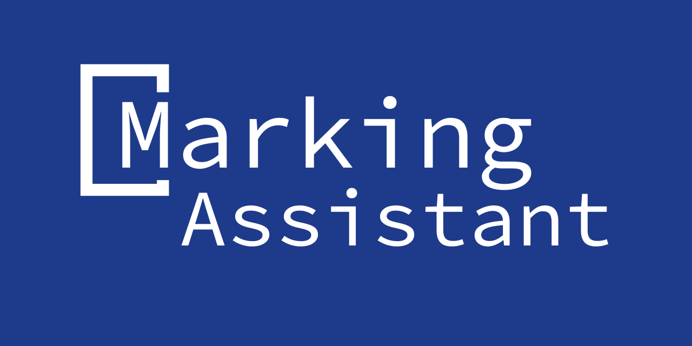

  

**Marking assistant** is a software solution that helps teachers get insights and assist essay, or short paragraph questions in an instant. Powered by an [NLP](https://en.wikipedia.org/wiki/Natural_language_processing) model that spot the difference between the student’s answer and a provided model answer. The software will spot ideas (or keywords) in the model answer, then compare it with ideas written in the student's answer, the teacher will get a report detailing which ideas were discussed, which ideas aren’t present in the model answer, and ideas missed by the student.

For the convenience of the teacher, other miscellaneous features will be added, such as an [OCR](https://en.wikipedia.org/wiki/Optical_character_recognition) software, insight reports, and tools to manage other types of questions (MCQ and match), making it a general-purpose exam management system in later iterations.

This is a graduation project for the [Faculty of Computers and Artificial Intelligence, Cairo University](http://fci.cu.edu.eg/).

## Why?

Essays and short answer questions are proven tools to assess higher-order student learning. They have the ability to capture what concepts the student has understood, is he able to draw connections and conclusions from it.

Thereby assessing if the student is capable of synthesize, integrate and apply his knowledge. ([Kaipa](https://www.emerald.com/insight/content/doi/10.1108/JARHE-01-2020-0011/full/html))

However, the process of marking essays is tedious and time-consuming. Teachers must read through the student’s answer, and compare it with the model answer, and then write a comment on the student’s answer. This process is time-consuming and prone to human error, and subjectivity.

## Solution

We are concentrating on 2 points to solve this problem:

1. **Objectivity** - By pointing out points from model answers and adjusting to grading data. We will be able to make grading more objective and improve consistency throughout all grades given.

2. **Convenience** - Grading will be more efficient, and the deep learning model will adjust to the existing grading patterns.

In the future, we will be adding more features to the system, such as:

- **Insight reports** - We are building a system that can provide insight reports to the teacher, such as the most common mistakes made by the students, the most common ideas discussed by the students, and the most common ideas missed by the students.

- **OCR** - We are building an OCR system that can read the student’s answer, and convert it into a text file. Making our product more practical on existing exam papers.

## Tech Stack

- [React](https://reactjs.org/)
- [TypeScript](https://www.typescriptlang.org/)
- [TailwindCSS](https://tailwindcss.com/)
- [SlateJS](https://www.slatejs.org/)

## Contributing

As this is a graduation project, we are not accepting any contributions at the moment. However, you can still fork the project and use it for your own purposes.

Also, if you have any suggestions or feedback, feel free to open an issue.
